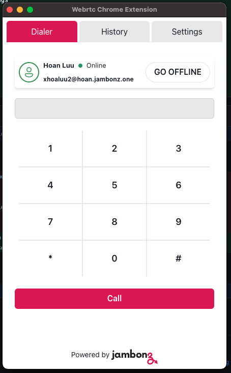
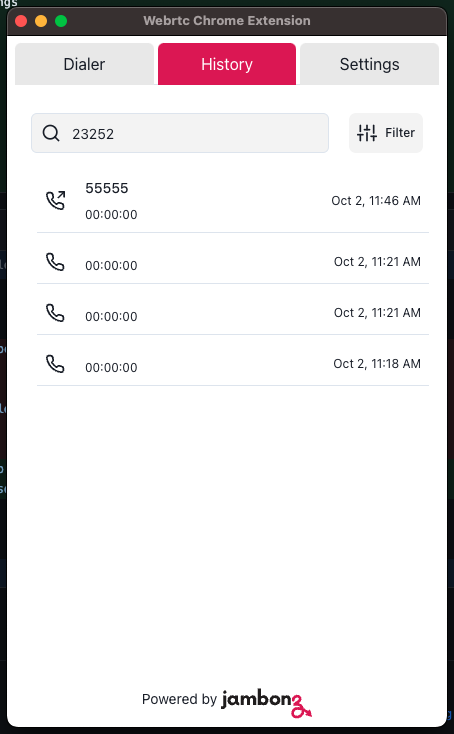
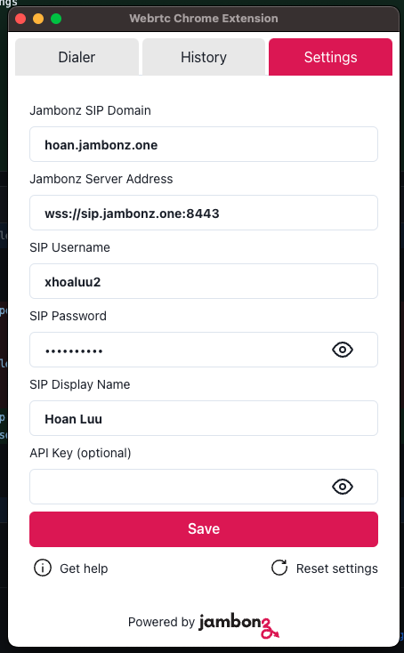

# Jambonz Webrtc Chrome extension dialer

The Jambonz WebRTC Chrome Extension Dialer is an easy-to-use browser extension that enables seamless WebRTC communication. With this extension, users can initiate voice calls directly from their web browsers without requiring additional software or hardware. It leverages Jambonz's open-source platform capabilities to handle VoIP communication with high quality and reliability. This extension is perfect for those who require frequent online communications, offering a streamlined experience with quick dialing features.

## Overview of the extension

<p float="left">
  
  
  
</p>

## How to build and install

### Build

```
npm run build
```

### Install

- Open Chrome/Egde
- Open Extensions --> Manage Extensions
- Choose Load Unpacked
- Browse to dist folder which is the result of npm run build command.
